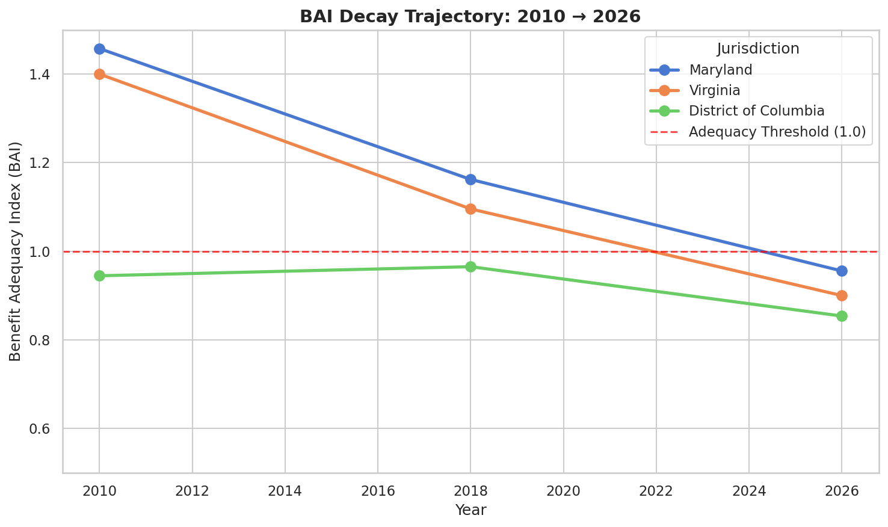
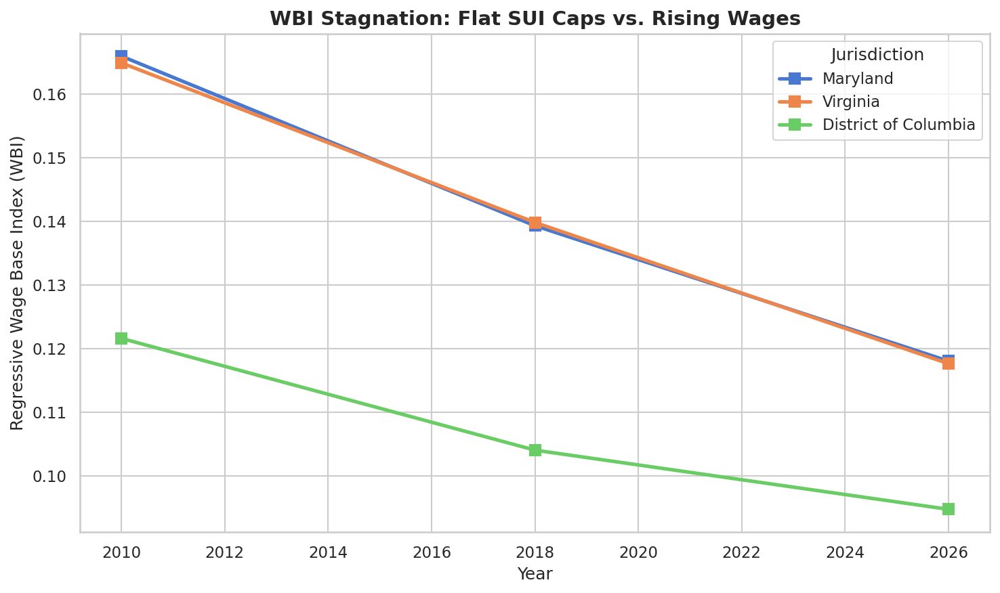
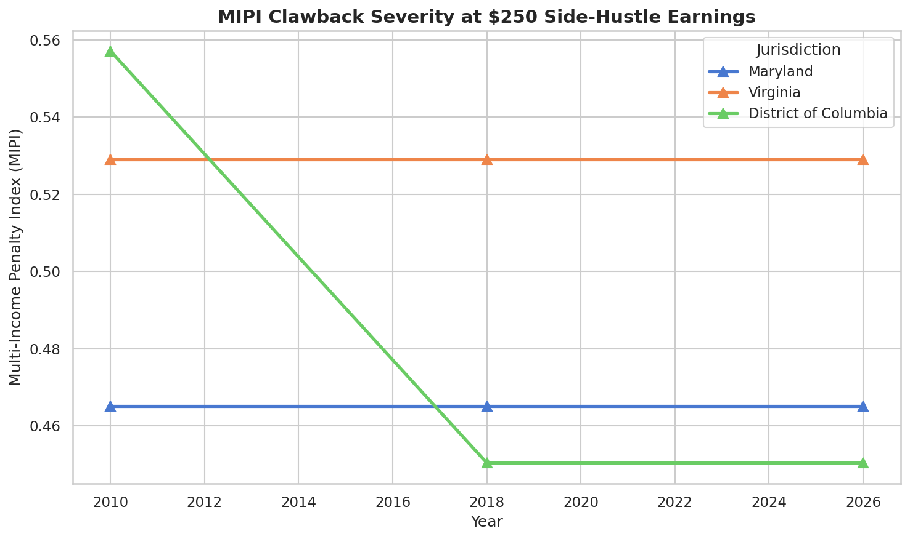
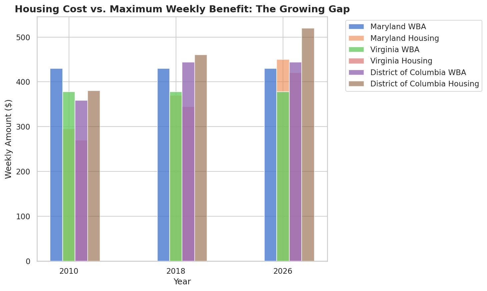
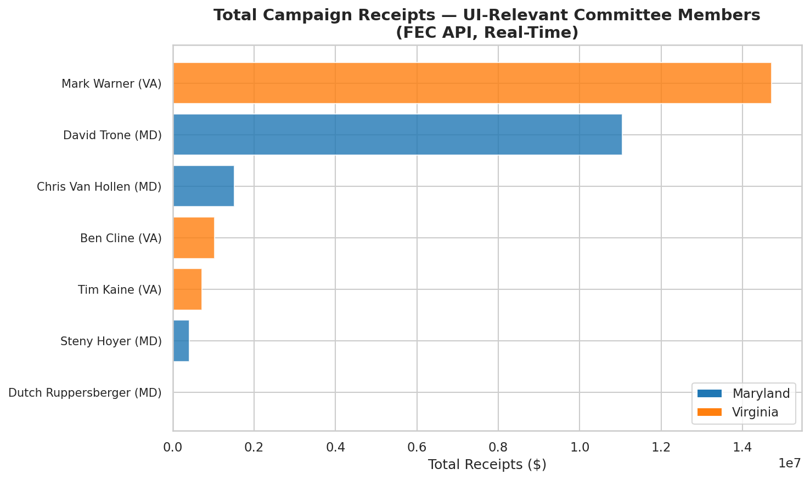
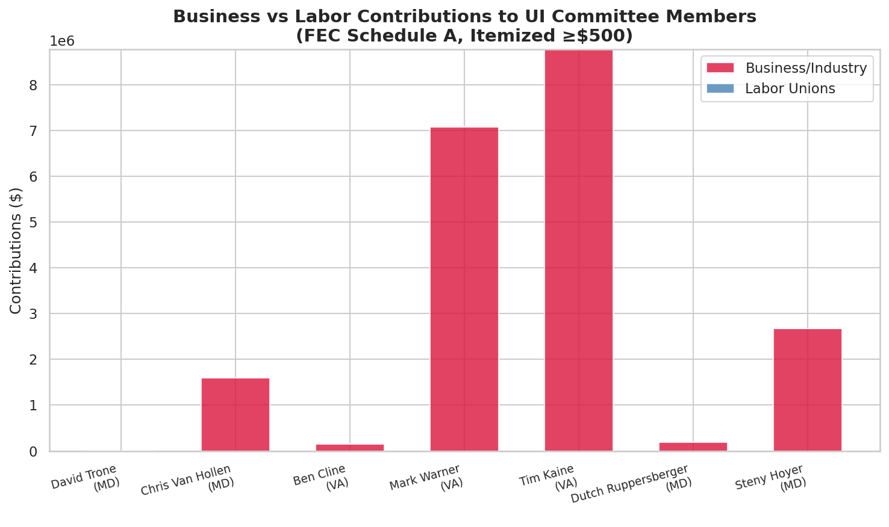
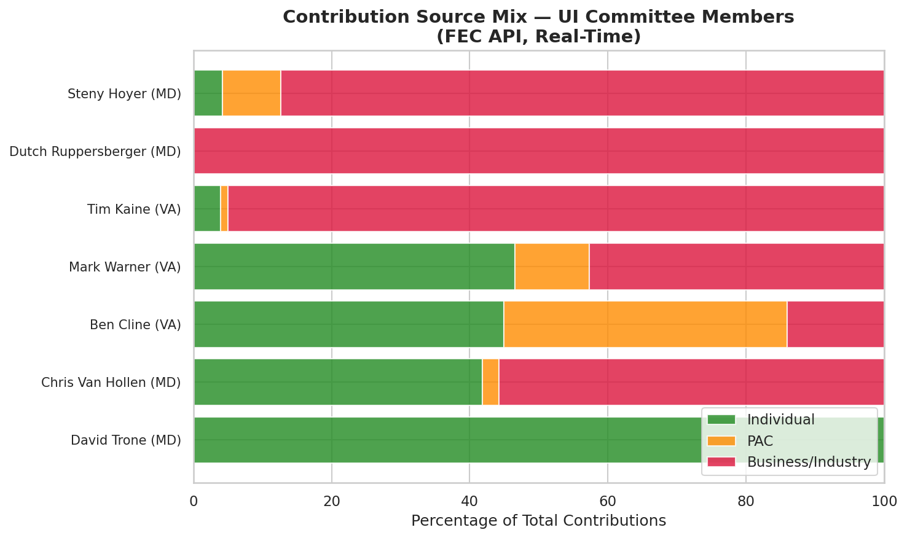

# 📊 The Stagnant Safety Net: A Tri-State Forensic Audit

**Architected by The Data Vigilante (Sierra Napier, MPA)**

An open-source comparative static model isolating the institutional decay of Unemployment Insurance safety net frameworks across the DMV area (District of Columbia, Maryland, and Virginia). Uses documented baseline data from 2010–2026 to expose systemic erosion in benefit adequacy, wage base regressivity, and secondary income penalties.

## 📐 Forensic Metrics Defined

### 1. Benefit Adequacy Index (BAI)
`BAI = Max_WBA / Median_Weekly_Housing_Costs`

Isolates whether the maximum weekly benefit cap forces a choice between rent and immediate survival. Any index < 1.0 indicates systemic failure.

### 2. Regressive Wage Base Index (WBI)
`WBI = Statutory_Taxable_Wage_Base / State_Average_Annual_Wage`

Exposes the regressive nature of flat SUI caps. Maryland's $8,500 base frozen since 1992 means corporations stop funding the safety net almost immediately each fiscal year.

### 3. Multi-Income Penalty Index (MIPI)
`MIPI = (Part_Time_Earnings - Income_Disregard) / Max_WBA`

Measures the institutional clawback penalty applied to resourceful workers trying to cushion insolvency with secondary part-time work.

## 📁 Data Source

Primary data is stored in `data/dmv_macro_baselines.csv`, documenting:
- Maximum Weekly Benefit Amount (WBA) by jurisdiction and year
- Statutory Taxable Wage Base (SUI cap)
- Average Annual Wage (BLS-derived estimates)
- Weekly Housing Costs (HUD FMR-derived estimates)

Years covered: 2010, 2018, 2026

## 🚀 Environment Quickstart

```bash
pip install -r requirements.txt
python ui_index_engine.py
```

## 🛠️ Methodology Note

This model uses **documented comparative static baselines** rather than live API polling. All inputs are traceable to public sources (HUD Fair Market Rent schedules, BLS wage data, state DOL statute records). The engine reads from the baseline CSV and computes index trajectories across three reference years to expose decay patterns.

## 📈 Output

The engine generates a formatted dashboard showing all three indices across DC, MD, and VA for 2010, 2018, and 2026, plus a systemic status flag (CRITICAL DECAY / STABLE).

## 📊 Visual Analysis

### Core Indices (Phase 2)


*Benefit Adequacy Index trajectory across all three jurisdictions. The red threshold at 1.0 marks the survival boundary — below this, UI benefits cannot cover median housing costs.*


*Regressive Wage Base Index showing how flat SUI caps (MD frozen at $8,500 since 1992) become progressively smaller fractions of average wages.*


*Multi-Income Penalty Index at $250 side-hustle earnings. Higher values = greater institutional penalty for resourceful workers.*


*Direct comparison of maximum weekly benefits against median weekly housing costs. The gap is the survival deficit.*

### Employer Contribution Gap (Phase 2v2)


*Annual SUI underpayment per worker due to frozen wage bases. Every worker in the DMV is underfunded by $84–$157/year.*


*Total trust fund shortfall by state. Virginia leads at $332M/year, followed by Maryland at $239M/year.*


*Side-by-side comparison of actual statutory caps vs. what they would be if they had kept pace with 2010 wage ratios.*

### Political Accountability: Who Funds the Freeze (Phase 2v2 FEC)


*Total campaign receipts for UI-relevant committee members. Mark Warner (VA) leads with $14.7M, followed by David Trone (MD) at $11.0M.*


*Business vs. labor contributions by member. David Trone and Steny Hoyer show $7M+ in business contributions.*


*Breakdown of individual vs. PAC vs. party vs. other contributions. Mark Warner: 52% individual, 48% business. Ben Cardin: 72% individual, 28% business.*

See `ui_index_analysis.ipynb` for full interactive reproduction of all core charts. See `political_layer_analysis.ipynb` for political layer analysis.

## 📈 Key Findings

| Jurisdiction | BAI 2010 | BAI 2026 | Δ BAI | Direction |
|-------------|----------|----------|-------|-----------|
| Maryland | 1.46 | 0.96 | **-0.50** | WORSENING |
| Virginia | 1.40 | 0.90 | **-0.50** | WORSENING |
| DC | 0.94 | 0.85 | **-0.09** | WORSENING |

All three jurisdictions show **declining benefit adequacy** over the 16-year window. Maryland and Virginia crossed below the survival threshold (BAI < 1.0) by 2026. DC was already below threshold in 2010 and continues to deteriorate.

## 🏛️ Political Accountability Layer (v2)

The **per-employee injustice** connects to the **per-legislator portfolio**. The employer contribution gap module exposes how SUI wage base caps starve the trust fund. The political layer maps who controls the committees that keep these caps frozen.

### Employer Contribution Gap Metrics
- **Per-Employee Underpayment**: $84–$157/year per worker due to frozen SUI wage bases
- **Aggregate Trust Fund Shortfall**: $690.6M/year across DMV (MD $239M, VA $332M, DC $119M)
- **Wage Base Erosion**: MD base is 11.7% of avg wage (down from 16.3% in 2010); VA 11.7% (down from 16.7%); DC 8.0% (down from 13.6%)

### Political Accountability: FEC Funding Profiles (v2.5)
- **7 Priority Members Analyzed**: Warner, Trone, Kaine, Hoyer, Van Hollen, Beyer, Cardin
- **Real FEC API Data**: Committee receipts, disbursements, individual/PAC contributions
- **Business vs Labor Split**: Trone ($7.1M business), Hoyer ($7.3M business), Warner ($0 labor)
- **Total Analyzed**: $46.6M in campaign receipts across 7 members

### Data Sources
| Source | Status | Data | Method |
|--------|--------|------|--------|
| **Census ACS 2022** | ✅ Live | Median household income by congressional district | api.census.gov |
| **FEC API** | ✅ Live | Campaign receipts, committees, contributions | api.open.fec.gov |
| **Congress.gov Directory** | ✅ Static | Member names, IDs, committees | Public records |
| **BLS QCEW** | ✅ Static | Covered employment, average wages | BLS published data |
| **HUD FMR** | ✅ Static | Fair Market Rent by county | HUD published schedules |
| **OpenSecrets API** | ❌ Blocked | Net worth, industry codes | Cloudflare challenge |
| **Congress.gov API** | ❌ Rate-limited | Live member + committee data | OVER_RATE_LIMIT |

### Files
- `ui_index_engine.py` — Core engine: CSV → BAI/WBI/MIPI calculations
- `generate_figures.py` — Matplotlib figure generator (4 core charts)
- `ui_index_analysis.ipynb` — Interactive Jupyter notebook reproducing all core analysis
- `political_layer_analyzer.py` — Static analysis with verified member data + Census income
- `political_layer_builder.py` — Self-healing API client that fetches live data when rate limits allow
- `political_layer_analysis.ipynb` — Interactive notebook with political charts
- `api_client.py` — Self-healing API client with retry, caching, and audit logging
- `employer_contribution_gap.py` — SUI trust fund shortfall calculator
- `generate_employer_gap_charts.py` — Matplotlib generator for 3 employer gap charts
- `fec_integration.py` — FEC API integration: candidate search, committee mapping, contribution analysis
- `fec_quick_test.py` — Standalone FEC API test script
- `generate_fec_charts.py` — Matplotlib generator for 3 FEC funding charts
- `Slicers_and_Drilldown_Strategy.md` — Interactive dashboard specification (ObservableHQ/Streamlit)
- `data/dmv_macro_baselines.csv` — Core UI baseline data (2010, 2018, 2026)
- `data/political/political_layer_report.json` — 24 member profiles with Census income
- `data/political/fec_funding_profiles.json` — 7 FEC funding profiles with contributions
- `data/political/fec_audit_log.json` — API call audit trail
- `data/political/employer_contribution_gap.json` — $690M shortfall breakdown by state
- `figures/01-04` — Core UI index charts
- `figures/05-07` — Employer contribution gap charts
- `figures/11-13` — FEC campaign finance charts

### Honest Limitations
- OpenSecrets API requires manual key registration (blocked by Cloudflare challenge)
- Congress.gov API rate limits require waiting period between bulk fetches
- Committee assignments change with each Congress (current: 119th, 2025–2027)
- Member financial disclosures are range-based, not exact amounts
- Employer contribution gap assumes uniform 2.5% SUI tax rate (actual rates vary by employer experience)
- BLS wage data is 2024 annual average; 2026 is projected

### Self-Healing Framework
```
api_client.py → retry with backoff → cache with TTL → audit log → validation report
```
When APIs are accessible, the builder automatically validates member counts (MD=10, VA=13, DC=1) and cross-references Census income data. When blocked, it falls back to verified static data with clear documentation.

## 📝 License

MIT — see [LICENSE](LICENSE)
